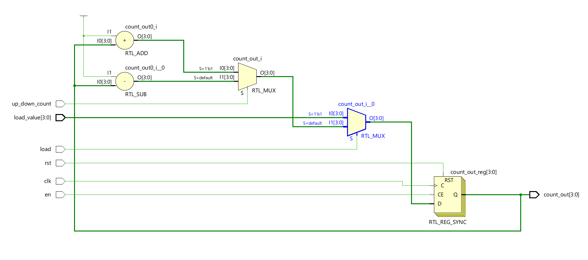
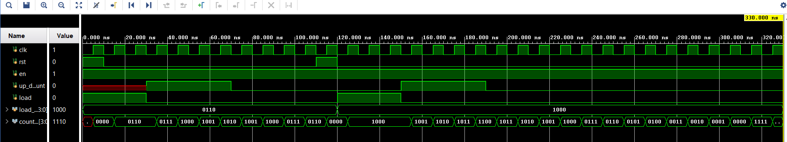

# Universal 4-bit Counter with Testbench

## Overview

This repository contains the Verilog RTL code and testbench for a versatile 4-bit counter. The design supports essential counter functionalities, including reset, enable, load, and configurable up/down counting.

## Project Structure
├── universal_counter.v       # Verilog RTL module for the counter
├── universal_counter_tb.v    # Verilog testbench for verification
├── wave.jpg                  # Simulation waveform image
├── RTL_view.jpg                  # RTL view image of the design
└── README.md                     # Project documentation

## Description

The `universal_counter.v` module implements a 4-bit synchronous counter with the following features:

* **Reset (`rst`):** Asynchronously resets the counter to 0.
* **Enable (`en`):** Enables or disables the counter's counting operation.
* **Load (`load`):** Loads a 4-bit value (`load_value`) into the counter.
* **Up/Down Count (`up_down_count`):** Selects between incrementing (up) and decrementing (down) counting modes.
* **Clock (`clk`):** Synchronizes the counter's operations.
* **Count Output (`count_out`):** The 4-bit counter's output.

The `universal_counter_tb.v` testbench provides comprehensive verification of the counter's functionality by applying various input sequences and monitoring the output.

## RTL View



The image above illustrates the Register-Transfer Level (RTL) view of the `universal_counter` module, showcasing the interconnection of registers and combinational logic.

## Waveform Simulation



The provided waveform image demonstrates the simulation results, verifying the counter's behavior under different input conditions.

## Prerequisites

To simulate and verify this design, you'll need:

* A Verilog simulator (e.g., Icarus Verilog , Vivado Simulator).
* A waveform viewer (e.g., GTKWave).

## Simulation Instructions

1.  Navigate to the directory containing `universal_counter.v` and `universal_counter_tb.v`.
2.  Compile the Verilog RTL and testbench files using your simulator.
3.  Run the simulation.
4.  Open the generated waveform file (e.g., `.vcd`) using a waveform viewer to analyze the results.

**Example using Icarus Verilog and GTKWave:**

```bash (LINUX)
iverilog universal_counter_tb.v
./a.out
gtkwave counter.vcd
